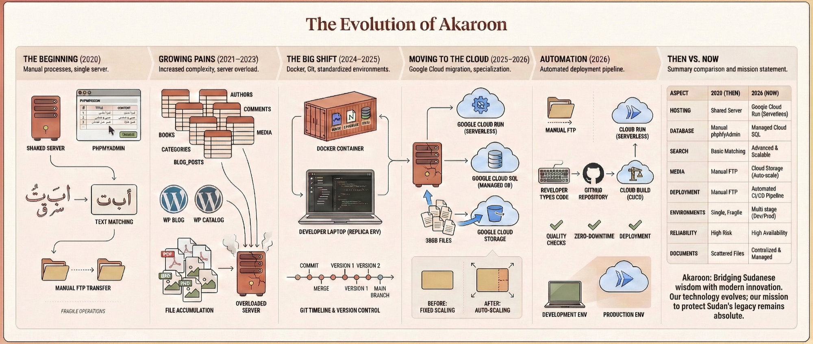
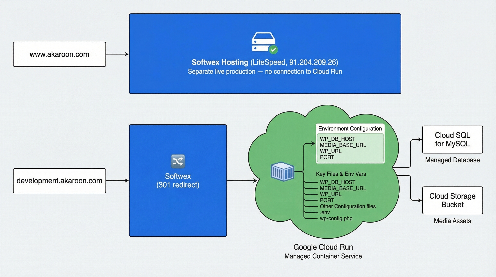
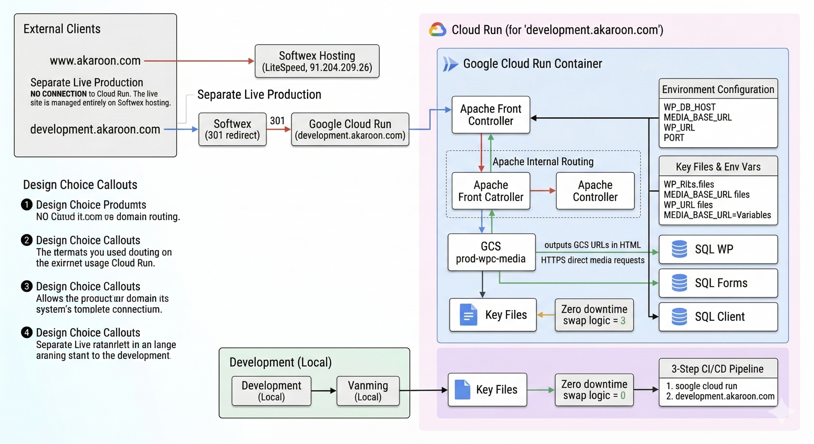
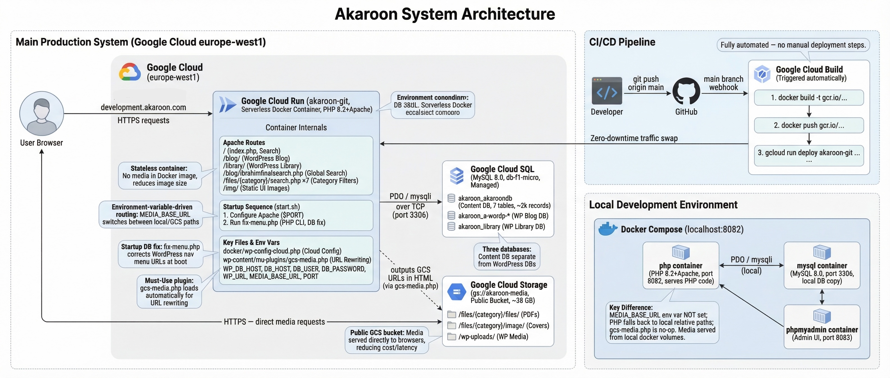

# What is Akaroon?
Akaroon is an online Sudanese heritage library primarily contributed to by volunteers and led by Prof. Ibrahim A. Omar. Its mission is to preserve Sudanese heritage knowledge for the next generation of Sudanese leaders. Since its launch in 2020, the website has undergone many changes to improve its services.
This repository is created to better manage the future development of the services. If you have any inquiries, you can contact me on my GitHub account or through the Akaroon website's contact form.

# Live Website
https://www.akaroon.com/

# Development Version
https://development.akaroon.com/

# Library Resources
The Akaroon Library contains over 2,000 documents and books organized into seven main themes: education, philosophy, politics, society, the state, organizations, and foundational studies.

## How to Access
Dear visitor, you can explore all the books and documents using the search feature on the website or by visiting the categories page. We welcome any comments or suggestions. You can also reach out to us through the "Contact Us" page or check out our blog, which features many articles and content related to the site that you can comment on or share on social media platforms.

# The Evolution of Akaroon

Akaroon did not start as a cloud platform. It started as a single shared server, a phpMyAdmin window, and a hand-built Arabic search. What follows is the full story of how it grew into what it is today.

## Platform Evolution Diagram



### Chapter-by-Chapter Breakdown

| Era | Years | What Changed |
|---|---|---|
| **The Beginning** | 2020 | Single shared server, phpMyAdmin for DB management, basic Arabic text matching, manual FTP file uploads |
| **Growing Pains** | 2021–2023 | 7 database tables across categories, WordPress Blog + WP Library added, media files piling up, server overloaded |
| **The Big Shift** | 2024–2025 | Docker containerisation — entire app packaged into a portable box. Git version control introduced. Developer can run an exact replica locally with `docker compose up` |
| **Moving to the Cloud** | 2025–2026 | Google Cloud Run (serverless), Cloud SQL (managed DB), Cloud Storage (38 GB media lifted off the server). Auto-scaling replaces fixed hosting |
| **Automation** | 2026 | Full CI/CD pipeline — `git push` triggers Cloud Build → Docker image → zero-downtime deploy to Cloud Run. No manual steps |

**Then vs. Now summary:**

| Aspect | 2020 (Then) | 2026 (Now) |
|---|---|---|
| Hosting | Shared server | Google Cloud Run (serverless) |
| Database | Manual phpMyAdmin | Managed Cloud SQL |
| Search | Basic text matching | UNION REGEXP across 7 tables + Arabic normalisation |
| Media | Manual FTP uploads | 38 GB on Cloud Storage, served globally |
| Deployment | FTP file-by-file | Automated CI/CD pipeline |
| Environments | Single, fragile | Local dev · Cloud Run staging · Live production |
| Reliability | High risk | High availability, zero-downtime updates |
| Documents | Scattered files | 2,351 PDFs + 2,273 cover images, centralised & managed |

---

# System Architecture

## Overview

Akaroon runs on **Google Cloud Run** (serverless, auto-scaling) backed by **Google Cloud SQL** for databases and **Google Cloud Storage** for all media. A GitHub push to `main` automatically triggers **Cloud Build**, which builds the Docker image and deploys it — zero manual steps required.

The live production site (`www.akaroon.com`) runs on **Softwex shared hosting** and is a completely separate system — the GitHub repository and Cloud Run environment serve as the development and staging platform, accessible at `development.akaroon.com`.

---

### Domain Routing



**How the two environments connect:**
- `www.akaroon.com` → resolves directly to **Softwex LiteSpeed hosting** (`91.204.209.26`). This is the live public-facing site. It has no connection to Cloud Run.
- `development.akaroon.com` → resolves to Softwex, which issues a **301 redirect** to the Cloud Run service URL. This is the staging/development environment where all new changes are tested before going live.

---

### Cloud Run Architecture



**Key design decisions shown in this diagram:**

1. **Two separate hosting systems** — `www.akaroon.com` (Softwex) and `development.akaroon.com` (Cloud Run) are completely independent. Changes deployed to Cloud Run do not affect the live site.

2. **Apache handles all internal routing** inside the container — every URL path (`/`, `/blog/`, `/library/`, `/files/{category}/`) is served by the same Apache instance, which routes to the correct PHP application.

3. **Three separate databases** — `akaroon_akaroondb` (library content), WordPress Blog DB, and WordPress Library DB are kept separate so content data and WordPress data never interfere with each other.

4. **GCS media decoupling** — the container outputs GCS URLs in HTML; the browser fetches media directly from Cloud Storage. The container never proxies media files, which keeps compute costs low and page load fast.

5. **Zero-downtime deploys** — Cloud Run creates a new revision on every deploy and shifts traffic only after the new container passes health checks. The old revision stays alive until traffic is fully migrated.

6. **`MEDIA_BASE_URL` as the environment switch** — when set, all PHP code and the WordPress MU plugin route media to GCS. When absent (local dev), all paths fall back to local relative URLs. The same codebase runs correctly in all three environments without code changes.

---

### Full System Architecture



---

## Architecture Diagram (text)

```
 ┌──────────────────────────────────┐       ┌──────────────────────────────────┐
 │  LIVE PRODUCTION                 │       │  DEVELOPMENT / STAGING           │
 │                                  │       │                                  │
 │  www.akaroon.com                 │       │  development.akaroon.com         │
 │  (Softwex Web Hosting)           │       │  (Softwex → 301 redirect)        │
 │  LiteSpeed · 91.204.209.26       │       │        │                         │
 │  Traditional PHP hosting         │       │        │ 301 redirect             │
 └──────────────────────────────────┘       └────────┼─────────────────────────┘
                                                     │
                                                     ▼
                              ┌──────────────────────────────────────────────┐
                              │       Google Cloud Run  (europe-west1)       │
                              │  akaroon-git-844063198632.europe-west1.run.app│
                              │  ┌────────────────────────────────────────┐  │
                              │  │  Docker Container (PHP 8.2 + Apache)   │  │
                              │  │                                        │  │
                              │  │  /          → homepage (index.php)     │  │
                              │  │  /blog/     → WordPress Blog           │  │
                              │  │  /library/  → WordPress Library        │  │
                              │  │  /blog/ibrahimfinalsearch.php          │  │
                              │  │             → Global Search            │  │
                              │  │  /files/{category}/ → Filter Pages ×7 │  │
                              │  │  /img/      → Static UI images         │  │
                              │  │                                        │  │
                              │  │  Startup: start.sh → fix-menu.php      │  │
                              │  │  ENV: DB_HOST · WP_URL · MEDIA_BASE_URL│  │
                              │  └────────────────────────────────────────┘  │
                              │        │ PDO/mysqli (TCP)  │ GCS URLs in HTML │
                              └────────┼──────────────────┼───────────────────┘
                                       ▼                  │
                         ┌─────────────────────┐         │  Browser fetches
                         │  Google Cloud SQL   │         │  media directly
                         │  MySQL 8.0          │         ▼
                         │  europe-west1       │  ┌────────────────────────┐
                         │                     │  │  Google Cloud Storage  │
                         │  akaroon_akaroondb  │  │  gs://akaroon-media    │
                         │  (7 tables, ~2,094  │  │  (public, europe-west1)│
                         │   Arabic records)   │  │                        │
                         │  akaroon_a-wordp-*  │  │  /files/*/files/ → PDF │
                         │  (WordPress Blog)   │  │  /files/*/image/ → JPG │
                         │  akaroon_library    │  │  /wp-uploads/ → media  │
                         │  (WordPress Lib.)   │  └────────────────────────┘
                         └─────────────────────┘            ▲
                                                            │ HTTPS
                                                  ┌─────────┴──────────┐
                                                  │  Users (Browser)   │
                                                  └────────────────────┘
```

---

## CI/CD Pipeline

```
Developer
    │
    │  git push origin main
    ▼
┌──────────────┐     webhook      ┌──────────────────────────────┐
│   GitHub     │ ───────────────► │   Google Cloud Build         │
│   (main)     │                  │                              │
└──────────────┘                  │  1. docker build -t gcr.io/  │
                                  │     akaroon-project/akaroon  │
                                  │  2. docker push → GCR        │
                                  │  3. gcloud run deploy        │
                                  │     akaroon-git              │
                                  └──────────────┬───────────────┘
                                                 │
                                                 ▼
                                  ┌──────────────────────────────┐
                                  │   Cloud Run (new revision)   │
                                  │   Zero-downtime deploy       │
                                  └──────────────────────────────┘
```

---

## Local Development

```
Developer Machine
  │
  │  docker compose up --build
  ▼
┌─────────────────────────────────────────────┐
│  Docker Compose  (localhost:8082)           │
│                                             │
│  ┌─────────────────┐  ┌─────────────────┐  │
│  │  php container  │  │  mysql container│  │
│  │  PHP 8.2+Apache │  │  MySQL 8.0      │  │
│  │  port 8082      │◄─┤  port 3306      │  │
│  └─────────────────┘  └─────────────────┘  │
│                                             │
│  ┌─────────────────┐                        │
│  │  phpmyadmin     │                        │
│  │  port 8083      │                        │
│  └─────────────────┘                        │
│                                             │
│  Media: served locally from                 │
│  public_html/files/*/  and                  │
│  public_html/blog/wp-content/uploads/       │
│  (MEDIA_BASE_URL not set → local paths)     │
└─────────────────────────────────────────────┘
```

---

## Application Components

| Component | Path | Technology | Description |
|---|---|---|---|
| **Homepage** | `/` | PHP + HTML/CSS/JS | Main landing page with search entry point |
| **WordPress Blog** | `/blog/` | WordPress 6.x + Nightingale theme | Editorial hub, articles, photo gallery, contact |
| **WordPress Library** | `/library/` | WordPress 6.x | Catalog front-end (second WP instance) |
| **Global Search** | `/blog/ibrahimfinalsearch.php` | Standalone PHP + PDO | Full-text UNION REGEXP across all 7 category tables with Arabic normalization (`arquery()`) |
| **Category Filters** | `/files/{category}/search.php` ×7 | PHP + PDO + AJAX | Per-category search: التأصيل, التعليم, الفلسفة, السياسة, المجتمع, الدولة, المنظمات |
| **Content DB** | `akaroon_akaroondb` | MySQL 8.0 | ~2,094 Arabic academic records, 7 tables |
| **Blog DB** | `akaroon_a-wordp-*` | MySQL 8.0 | WordPress posts, menus, media metadata |
| **Library DB** | `akaroon_library` | MySQL 8.0 | WordPress Library instance database |
| **GCS Media** | `gs://akaroon-media` | Google Cloud Storage | 2,351 PDFs + 2,273 cover images + WordPress uploads (~38 GB total) |

---

## WordPress Customisations

| File | Purpose |
|---|---|
| `docker/wp-config-cloud.php` | Production WP config — Cloud SQL IP, HTTPS proxy fix, GCS env vars |
| `docker/fix-menu.php` | Startup script — rewrites nav menu URLs in DB to match the Cloud Run hostname |
| `wp-content/mu-plugins/gcs-media.php` | Must-Use plugin — rewrites all WordPress media URLs from localhost to GCS at render time |

---

## Environment Variables (Cloud Run)

| Variable | Value | Used By |
|---|---|---|
| `WP_DB_HOST` | `34.76.91.107` | WordPress Blog & Library DB connection |
| `DB_HOST` | `34.76.91.107` | PHP category filter pages |
| `DB_USER` | `akaroon` | All DB connections |
| `DB_PASSWORD` | _(secret)_ | All DB connections |
| `WP_URL` | `https://akaroon-git-844063198632.europe-west1.run.app` | fix-menu.php nav URL rewrite |
| `MEDIA_BASE_URL` | `https://storage.googleapis.com/akaroon-media` | GCS media routing for PDFs, images, WP uploads |
| `PORT` | set by Cloud Run | Apache listen port |

---

## Known Issues & Notes

### Elementor Plugin — Disabled (March 2026)

**Status:** Elementor is **permanently disabled** (`wp-content/plugins/elementor.disabled/`).

**Reason:** Updating Elementor caused a PHP 8 fatal crash — it passed `null` to a method now enforcing a strict `string` type. The blog renders correctly without it using the Nightingale theme alone.

**To re-enable:** Verify PHP 8.2 compatibility → rename `elementor.disabled` → `elementor` → test locally at `localhost:8082/blog/` before deploying.
