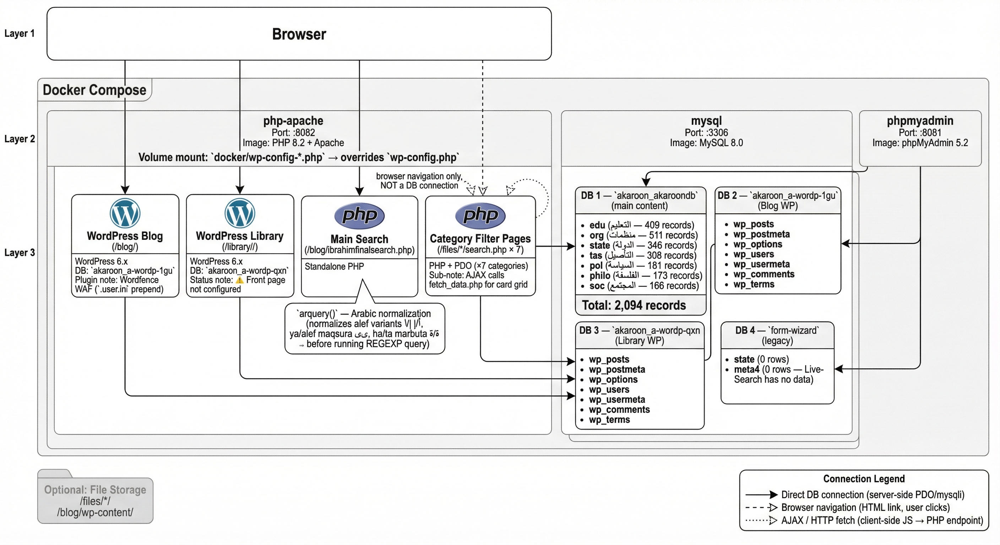
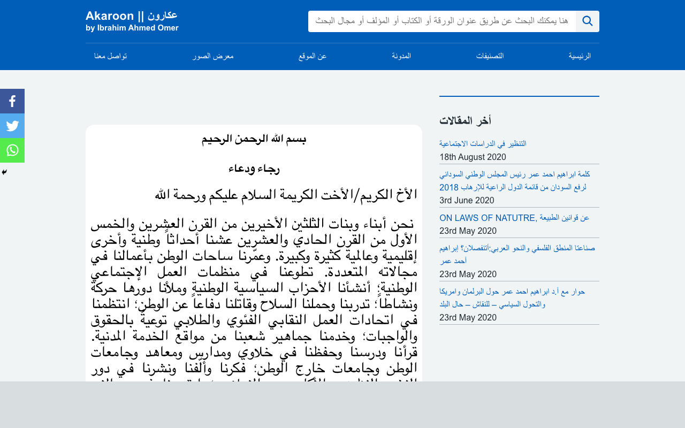
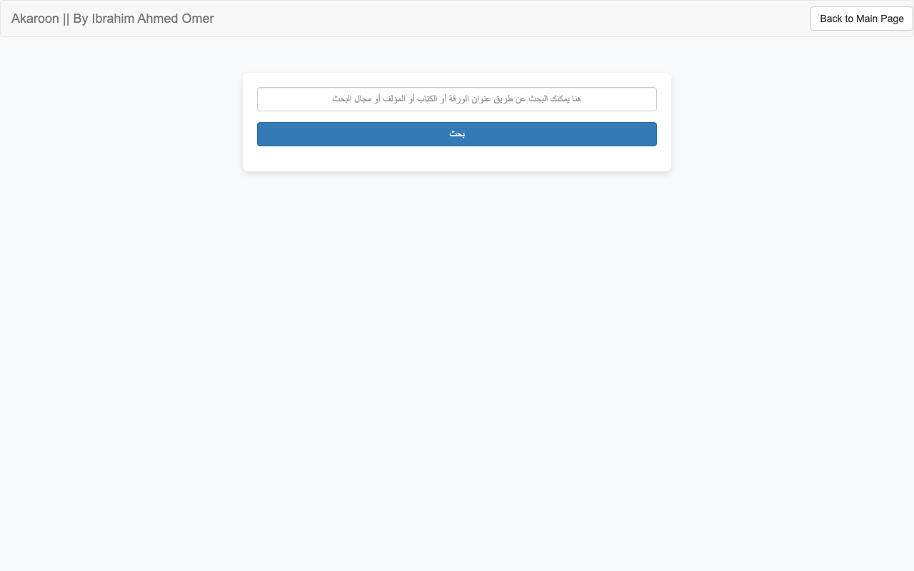
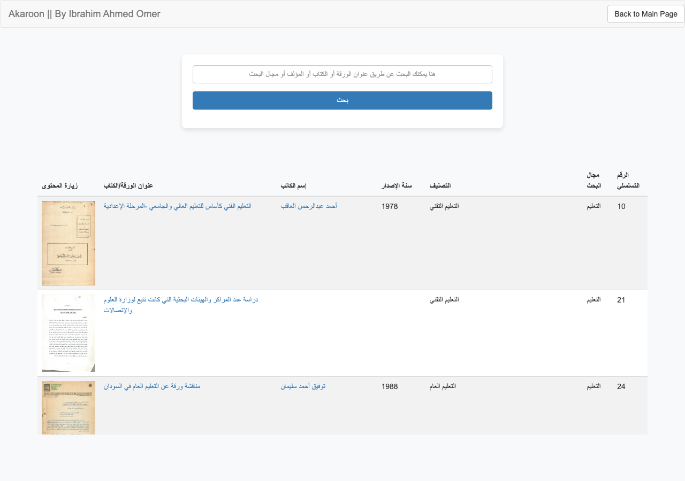
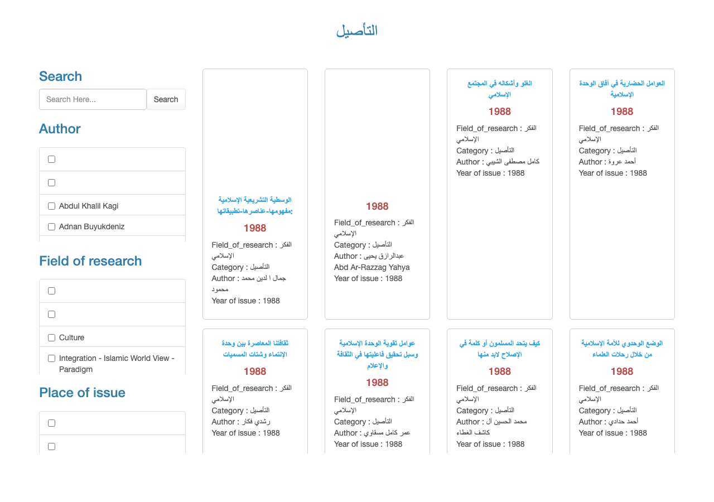

# What is Akaroon?
Akaroon is an online Sudanese heritage library primarily contributed to by volunteers and led by Prof. Ibrahim A. Omar. Its mission is to preserve Sudanese heritage knowledge for the next generation of Sudanese leaders. Since its launch in 2020, the website has undergone many changes to improve its services.
This repository is created to better manage the future development of the services. If you have any inquiries, you can contact me on my GitHub account or through the Akaroon website's contact form.

# Live Website
https://www.akaroon.com/

# Development Version
https://development.akaroon.com/

# Library Resources
The Akaroon Library contains over 2,000 documents and books organized into seven main themes: education, philosophy, politics, society, the state, organizations, and foundational studies.

## How to Access
Dear visitor, you can explore all the books and documents using the search feature on the website or by visiting the categories page. We welcome any comments or suggestions. You can also reach out to us through the "Contact Us" page or check out our blog, which features many articles and content related to the site that you can comment on or share on social media platforms.

# System Architecture

The diagram below shows the full technical architecture of the Akaroon platform, including the Docker infrastructure, PHP applications, WordPress instances, and MySQL databases.



## Screenshots

| Blog Homepage | Main Search |
|---|---|
|  |  |

| Search Results | Category Filter (التأصيل) |
|---|---|
|  |  |

## Known Issues & Notes

### ⚠️ Elementor Plugin — Do Not Update / Not Required (March 2026)

**Status:** Elementor is **permanently disabled** (`wp-content/plugins/elementor.disabled/`).

**What happened:** Updating Elementor to its latest version caused a PHP 8 fatal crash on the entire WordPress blog:
```
PHP Fatal error: Uncaught TypeError:
Elementor\Modules\EditorOne\Components\Sidebar_Navigation_Handler::add_body_class()
Argument #1 ($classes) must be of type string, null given
```
WordPress was passing `null` to a method that now enforces a strict `string` type — a PHP 8.x incompatibility introduced in the update.

**Fix applied:** Renamed the plugin folder to `elementor.disabled` to deactivate it from the filesystem without needing wp-admin access.

**Why Elementor is not needed:** The blog pages are already published and rendering correctly using the Nightingale theme alone. Elementor was only used during initial page setup and is not required for the site to function.

**If you ever need to re-enable Elementor:**
1. Check that the Elementor version is compatible with PHP 8.2 before enabling
2. Rename `elementor.disabled` back to `elementor`
3. Test at `localhost:8082/blog/` before deploying to production

---

## Main Components

| Component | Description |
|---|---|
| **WordPress Blog** (`/blog/`) | Editorial and navigation hub, links users into the library system |
| **WordPress Library** (`/library/`) | Second WP instance intended as a catalog front-end |
| **Main Search** (`ibrahimfinalsearch.php`) | Standalone PHP — 7-table UNION REGEXP query with Arabic normalization (`arquery()`) |
| **Category Filter Pages** (`/files/*/search.php` ×7) | PHP + PDO mini-apps, one per academic category, with AJAX card grids |
| **Content Database** (`akaroon_akaroondb`) | ~2,094 Arabic academic records across 7 category tables |
| **Docker Infrastructure** | PHP 8.2 + Apache + MySQL 8.0 + phpMyAdmin, running on port 8082 locally |
